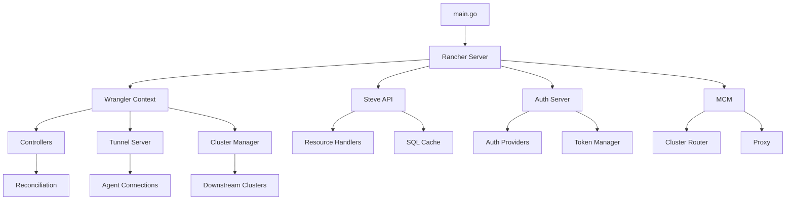

## Server Components

Rancher's server architecture is composed of several major subsystems that work together to provide cluster management capabilities.

## API Layer

### Steve API (v1)

Steve is Rancher's modern API layer providing a Kubernetes-native experience.

<Info>
Steve API is located in `pkg/api/steve/` and provides the `/v1` API endpoints.
</Info>

**Key Features:**

- **Dynamic Schema Discovery**: Automatically discovers and exposes all Kubernetes resources
- **Watch Streams**: Real-time WebSocket updates for resource changes
- **SQL Cache**: Optional caching layer for improved performance
- **Aggregation**: Combines resources from multiple clusters
- **Field Selectors**: Advanced filtering capabilities

```go Steve Configuration
// From pkg/rancher/rancher.go:294
steve, err := steveserver.New(ctx, restConfig, &steveserver.Options{
    ServerVersion:   settings.ServerVersion.Get(),
    Controllers:     steveControllers,
    AccessSetLookup: wranglerContext.ASL,
    AuthMiddleware:  steveauth.ExistingContext,
    Next:            ui.New(...),
    ClusterRegistry: opts.ClusterRegistry,
    SQLCache:        features.UISQLCache.Enabled(),
})
```

### Norman API (v3)

The Norman API provides Rancher-specific resources and operations.

<Note>
Norman API is in `pkg/api/norman/` and serves legacy `/v3` endpoints for Rancher-specific resources.
</Note>

**Responsibilities:**

- Cluster management resources
- Project and namespace management  
- User and token management
- Auth provider configurations
- Legacy cluster operations

<CodeGroup>
```yaml Norman Resources
# Key resource types:
/v3/clusters               # Cluster definitions
/v3/projects               # Project resources
/v3/users                  # User management
/v3/tokens                 # API tokens
/v3/principals             # Identity principals
/v3/clusterRegistrationTokens  # Registration
```
</CodeGroup>

### API Middleware Stack

The request processing pipeline:

```go Middleware Chain
// From pkg/rancher/rancher.go:390
Handler: responsewriter.Chain{
    auth.SetXAPICattleAuthHeader,
    responsewriter.ContentTypeOptions,
    responsewriter.NoCache,
    websocket.NewWebsocketHandler,
    proxy.RewriteLocalCluster,
    clusterProxy,
    aggregationMiddleware,
    additionalAPIPreMCM,
    wranglerContext.MultiClusterManager.Middleware,
    authServer.Management,
    additionalAPI,
    requests.NewRequireAuthenticatedFilter("/v1/", "/v1/management.cattle.io.setting"),
}.Handler(steve)
```

<Steps>
  <Step title="Auth Header">
    Sets X-API-Cattle-Auth header for authentication status
  </Step>
  <Step title="Security Headers">
    Content-Type-Options and cache control
  </Step>
  <Step title="WebSocket Upgrade">
    Handles watch stream upgrades
  </Step>
  <Step title="Cluster Proxy">
    Routes requests to downstream clusters
  </Step>
  <Step title="Aggregation">
    Handles aggregated API requests
  </Step>
  <Step title="MCM">
    Multi-cluster manager processing
  </Step>
  <Step title="Steve API">
    Final handler for resource operations
  </Step>
</Steps>

## Authentication System

The authentication system is implemented in `pkg/auth/` and provides pluggable authentication.

### Auth Server Structure

```go Auth Server
// From pkg/auth/server.go:31
type Server struct {
    Authenticator steveauth.Middleware
    Management    func(http.Handler) http.Handler
    scaledContext *config.ScaledContext
}
```

### Authentication Providers

Located in `pkg/auth/providers/`, Rancher supports:

<Tabs>
  <Tab title="Local">
    **Local Provider**
    
    - Username/password authentication
    - PBKDF2 password hashing
    - Stored in Kubernetes secrets
    - Bootstrap admin user support
    
    ```go
    // Namespace: cattle-local-user-passwords
    // Password storage with PBKDF2
    ```
  </Tab>
  
  <Tab title="SAML">
    **SAML Provider**
    
    - SAML 2.0 authentication
    - Multiple IdP support
    - Group membership sync
    - Endpoints: `/v1-saml/*`
    
    Handler: `pkg/auth/providers/saml`
  </Tab>
  
  <Tab title="OIDC">
    **OIDC Provider**
    
    - OpenID Connect support
    - Multiple OIDC providers
    - Token refresh
    - PKCE support
    
    Handler: Registered in `pkg/auth/handler`
  </Tab>
  
  <Tab title="LDAP/AD">
    **LDAP/Active Directory**
    
    - FreeIPA, OpenLDAP, AD
    - User and group sync
    - Nested group support
    - Connection pooling
  </Tab>
  
  <Tab title="External">
    **Other Providers**
    
    - GitHub
    - Google
    - Azure AD
    - Keycloak
    - Okta
    - Ping Identity
  </Tab>
</Tabs>

### Token Management

Token management is handled by `pkg/auth/tokens/`:

```go Token Types
// API Tokens
- User tokens: Long-lived API access
- Kubeconfig tokens: For kubectl access  
- Cluster tokens: Agent registration

// Automatic token cleanup
tokens.StartPurgeDaemon(ctx, management)
```

<Warning>
Tokens are stored as Kubernetes secrets and should be protected with appropriate RBAC rules.
</Warning>

## Controller System

Controllers are located in `pkg/controllers/` and implement reconciliation logic.

### Controller Categories

<AccordionGroup>
  <Accordion title="Management Controllers">
    **Location**: `pkg/controllers/management/`
    
    Core management reconciliation:
    - Cluster lifecycle management
    - Node driver management
    - Auth configuration sync
    - Secret encryption
    - User cleanup and retention
    
    ```go
    // Register management controllers
    management.RegisterIndexers(wranglerContext)
    ```
  </Accordion>
  
  <Accordion title="Provisioning V2 Controllers">
    **Location**: `pkg/controllers/provisioningv2/`
    
    Modern cluster provisioning:
    - RKE2 cluster provisioning
    - K3s cluster provisioning
    - Cluster API (CAPI) integration
    - Machine management
    - Bootstrap configuration
    
    ```go
    // From pkg/rancher/rancher.go:205
    if features.ProvisioningV2.Enabled() {
        provisioningv2.RegisterIndexers(wranglerContext)
    }
    ```
  </Accordion>
  
  <Accordion title="Dashboard Controllers">
    **Location**: `pkg/controllers/dashboard/`
    
    Dashboard and UI support:
    - UI extension management
    - Plugin lifecycle
    - APIService registration
    - Dashboard data seeding
  </Accordion>
  
  <Accordion title="Management Agent Controllers">
    **Location**: `pkg/controllers/managementagent/`
    
    Downstream cluster agents:
    - Node management
    - Workload management
    - Monitoring integration
    - Logging integration
    - App deployment
  </Accordion>
</AccordionGroup>

### Controller Registration Pattern

```go Controller Setup
// Standard controller registration
func Register(ctx context.Context, wrangler *wrangler.Context) {
    // Create controller
    controller := wrangler.Mgmt.Cluster().OnChange(ctx, "cluster-controller", handler)
    
    // Register indexers
    wrangler.Mgmt.Cluster().Cache().AddIndexer(indexName, indexFunc)
}

// Leader election
wrangler.OnLeader(func(ctx context.Context) error {
    // Start controllers that should only run on leader
    return controller.Start(ctx)
})
```

## Cluster Router

The cluster router (`pkg/clusterrouter/`) handles routing requests to downstream clusters.

### Proxy Architecture

<Tip>
Cluster proxy implements intelligent routing with support for both tunneled and direct connections.
</Tip>

```go Proxy Middleware
// From pkg/rancher/rancher.go:313
clusterProxy, err := proxy.NewProxyMiddleware(
    wranglerContext.K8s.AuthorizationV1(),
    wranglerContext.TunnelServer.Dialer,
    wranglerContext.Mgmt.Cluster().Cache(),
    localClusterEnabled(opts),
    steve,
)
```

**Routing Logic:**

1. Parse cluster ID from request path
2. Look up cluster connection info
3. Check RBAC permissions
4. Route via tunnel or direct connection
5. Impersonate user context
6. Proxy request to cluster API

## Tunnel Server

The tunnel server (`pkg/tunnelserver/`) provides WebSocket-based bidirectional communication.

### Peer Manager

```go Peer Management
// From pkg/tunnelserver/peermanager.go:33
type peerManager struct {
    leader    bool
    ready     bool  
    token     string
    urlFormat string
    server    *remotedialer.Server
    peers     map[string]bool
    listeners map[chan<- peermanager.Peers]bool
}
```

**Features:**

- **Multi-Replica Support**: Peers coordinate via endpoints
- **Connection Distribution**: Agents connect to available replicas
- **Automatic Failover**: Reconnect on replica failure
- **Leader Election**: Consistent peer view

### Tunnel Authorizer

Located in `pkg/tunnelserver/mcmauthorizer/`:

```go Authorization
// Validates cluster registration tokens
// Ensures agent identity
// Enforces connection policies
```

## Agent Components

Agent components run on downstream clusters.

### Cluster Agent

**Location**: `pkg/agent/cluster/`

```go Agent Bootstrap
// From pkg/agent/cluster/cluster.go:20
const (
    rancherCredentialsFolder = "/cattle-credentials"
    urlFilename              = "url"
    tokenFilename            = "token"  
    namespaceFilename        = "namespace"
)

// Agent reads connection parameters
func TokenAndURL() (string, string, error)
```

**Responsibilities:**

- Maintain WebSocket tunnel to Rancher server
- Execute cluster operations
- Report cluster status
- Proxy API requests from server

### Node Agent

Runs on each node for:

- Node status reporting
- Log collection
- Metrics gathering

## Wrangler Context

The Wrangler context (`pkg/wrangler/`) provides shared controllers and clients.

```go Wrangler Components
// From pkg/wrangler/context.go
type Context struct {
    K8s                    kubernetes.Interface
    SharedControllerFactory *controller.SharedControllerFactory
    MultiClusterManager    MultiClusterManager
    TunnelServer          *remotedialer.Server
    ASL                   accesscontrol.AccessSetLookup
    // ... controller groups
    Mgmt    mgmt.Interface
    Core    core.Interface
    RBAC    rbac.Interface
}
```

<Info>
Wrangler provides a unified interface for all Kubernetes resources with automatic caching and indexing.
</Info>

## Data Management

### Custom Resource Definitions

Rancher defines CRDs in several API groups:

<CardGroup cols={2}>
  <Card title="management.cattle.io" icon="network-wired">
    Core Rancher resources:
    - Cluster
    - Project  
    - User
    - Token
    - Setting
  </Card>
  
  <Card title="provisioning.cattle.io" icon="server">
    Provisioning resources:
    - Cluster (v2)
    - Machine
    - MachinePool
  </Card>
  
  <Card title="fleet.cattle.io" icon="ship">
    GitOps resources:
    - GitRepo
    - Bundle
    - Cluster (Fleet)
  </Card>
  
  <Card title="catalog.cattle.io" icon="book">
    App catalog:
    - ClusterRepo
    - App
    - Operation
  </Card>
</CardGroup>

### CRD Migration

CRD management in `pkg/crds/`:

```go CRD Setup
// From pkg/rancher/rancher.go:216
if err := crds.EnsureRequired(ctx, clientSet); err != nil {
    return nil, fmt.Errorf("failed to ensure CRDs: %w", err)
}

if err := dashboardcrds.Create(ctx, restConfig); err != nil {
    return nil, fmt.Errorf("failed to create CRDs: %w", err)  
}
```

## Feature Flags

Feature management in `pkg/features/`:

```go Feature Flags
// Key features with toggles
features.MCM.Enabled()              // Multi-cluster manager
features.Fleet.Enabled()            // GitOps fleet
features.ProvisioningV2.Enabled()   // New provisioning
features.Auth.Enabled()             // Authentication
features.UIExtension.Enabled()      // UI plugins
features.UISQLCache.Enabled()       // SQL caching
```

<Warning>
Changing feature flags requires Rancher restart and may affect cluster operations.
</Warning>

## Settings Management

Global settings in `pkg/settings/`:

```go Common Settings
settings.ServerVersion.Get()        // Rancher version
settings.ServerURL.Get()            // Server URL
settings.CACerts.Get()              // CA certificates
settings.AgentTLSMode.Get()         // TLS validation mode
settings.Namespace.Get()            // System namespace
settings.PeerServices.Get()         // HA peer services
```

Settings are stored as CRDs and can be configured via:
- UI: Settings page
- CLI: `kubectl edit setting <name>`
- API: `/v1/management.cattle.io.setting`

## System Dependencies

Rancher relies on several external dependencies and automatically installs system charts for core functionality.

### External Dependencies

**Required:**
- **Kubernetes Cluster**: Version 1.x < 1.36.0 - Rancher must run on a supported Kubernetes cluster

**Optional:**
- **cert-manager**: Required for TLS certificate management when using Rancher-generated certificates or Let's Encrypt. Not needed if bringing your own certificates.

### System Charts (Auto-installed)

Rancher automatically installs and manages several system charts that provide core functionality:

**Core System Charts:**

<Accordion title="Fleet (cattle-fleet-system namespace)">
Fleet is Rancher's GitOps continuous delivery engine that enables cluster-wide and multi-cluster application deployment.

- Manages GitRepo resources for application deployment
- Handles bundle distribution across clusters
- Provides drift detection and reconciliation
</Accordion>

<Accordion title="Rancher Webhook (cattle-system)">
Provides validation and mutation webhooks for Rancher resources.

- Validates resource specifications before admission
- Enforces security policies
- Mutates resources with default values
</Accordion>

**Cloud Provider Operators (Conditional):**

These operators are installed automatically when managing clusters on specific cloud providers:

- **aks-operator**: Azure Kubernetes Service integration (rancher-operator-system)
- **eks-operator**: Amazon Elastic Kubernetes Service integration (rancher-operator-system)
- **gke-operator**: Google Kubernetes Engine integration (rancher-operator-system)
- **ali-operator**: Alibaba Cloud integration (rancher-operator-system)

**Optional System Charts:**

- **System Upgrade Controller**: Automates Kubernetes cluster upgrades (cattle-system)
- **Rancher Turtles**: Cluster API (CAPI) lifecycle management integration (rancher-turtles-system)

<Note>
System charts are managed by Rancher and should not be modified directly. Configuration should be done through Rancher's UI or API.
</Note>

## System Namespaces

Rancher creates and manages several namespaces for organizing system components:

| Namespace | Purpose |
|-----------|---------|
| `cattle-system` | Core Rancher server components and webhooks |
| `cattle-fleet-system` | Fleet GitOps controller and resources |
| `cattle-impersonation-system` | Impersonation tokens for cluster access |
| `cattle-telemetry-system` | Telemetry collection and reporting |
| `rancher-operator-system` | Cloud provider operators (AKS, EKS, GKE, Alibaba) |
| `cattle-csp-adapter-system` | CSP (Cloud Service Provider) adapter for Rancher Prime |
| `cattle-scc-system` | Support and connectivity check for Rancher Prime |

<Warning>
Do not delete these namespaces manually. They are required for Rancher operation and will be recreated automatically if removed.
</Warning>

## Service Account Management

Service account token handling in `pkg/serviceaccounttoken/`:

```go Token Lifecycle
// Automatic secret creation for SA tokens (K8s 1.24+)
serviceaccounttoken.EnsureSecretForServiceAccount(ctx, ...)

// Cleanup of unused tokens
serviceaccounttoken.StartServiceAccountSecretCleaner(ctx, ...)
```

## Extension API Server

Optional extension API server for imperative operations:

```go Extension Server
// From pkg/ext/
extensionAPIServer, err := ext.NewExtensionAPIServer(
    ctx, wranglerContext, extensionOpts,
)

// Provides:
// - Imperative shell access
// - Log streaming  
// - File operations
// - Custom actions
```

## Component Dependencies



## Next Steps

<CardGroup cols={2}>
  <Card title="Security Architecture" icon="shield" href="/architecture/security">
    Learn about authentication, RBAC, and security features
  </Card>
  <Card title="Architecture Overview" icon="sitemap" href="/architecture/overview">
    Review high-level architecture concepts
  </Card>
</CardGroup>
