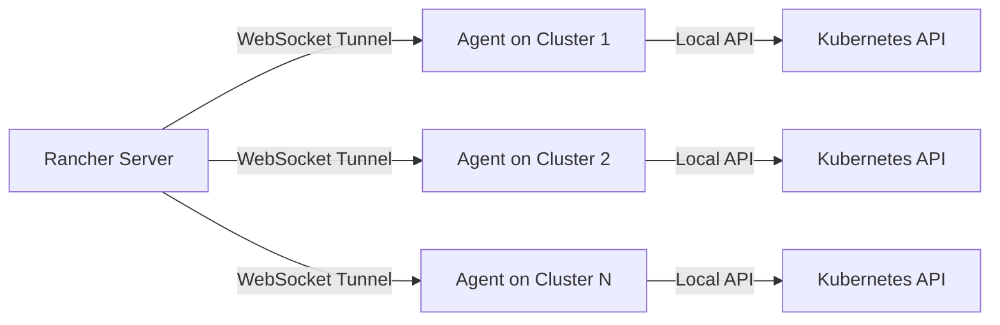
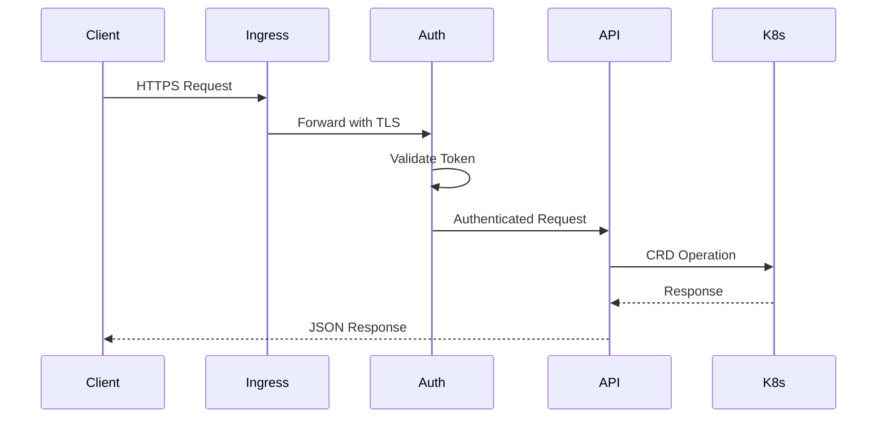
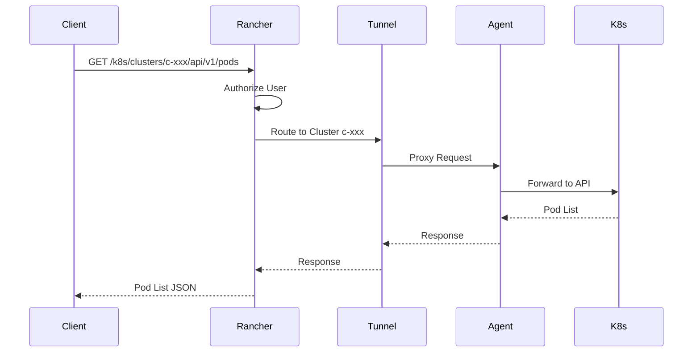

## Introduction

Rancher is a complete container management platform built for organizations that deploy containers in production. It provides a centralized authentication and access control system for managing multiple Kubernetes clusters from a single interface.

## High-Level Architecture

Rancher follows a hub-and-spoke architecture pattern with these core concepts:

<CardGroup cols={2}>
  <Card title="Management Cluster" icon="server">
    The central Rancher server that runs in a Kubernetes cluster and manages all downstream clusters.
  </Card>
  <Card title="Downstream Clusters" icon="network-wired">
    Kubernetes clusters managed by Rancher, which can be imported, created, or hosted.
  </Card>
</CardGroup>

## Core Architecture Components

### Rancher Server

The Rancher server is the central management hub that consists of:

- **API Server**: Multi-versioned API system (Norman v3 and Steve v1)
- **Authentication System**: Pluggable authentication with support for multiple providers
- **Controller Manager**: Reconciliation loops for managing cluster state
- **UI Server**: Web-based management interface
- **Extension API Server**: Kubernetes API aggregation for imperative operations

<Info>
The main server process is defined in `main.go:49` and initializes with the command: `Complete container management platform`
</Info>

### Cluster Management Model

#### Upstream vs Downstream

<AccordionGroup>
  <Accordion title="Upstream Cluster (Management/Local)">
    - Runs the Rancher server components
    - Stores cluster configurations and state
    - Manages authentication and RBAC policies
    - Can optionally manage workloads when configured as "local" cluster
    - Namespace: `cattle-system`
  </Accordion>
  
  <Accordion title="Downstream Clusters">
    - Kubernetes clusters managed by Rancher
    - Run the Rancher agent for communication
    - Can be imported, provisioned, or hosted
    - Independent Kubernetes API servers
  </Accordion>
</AccordionGroup>

## Communication Patterns

### Tunnel Server Architecture

Rancher uses a WebSocket-based tunnel system for secure cluster communication:



<Note>
The tunnel server is implemented in `pkg/tunnelserver/` and uses the `remotedialer` library for bidirectional communication.
</Note>

### Agent-Server Communication

Key aspects of the communication model:

1. **Outbound Connections Only**: Agents initiate connections to the Rancher server via WebSocket
2. **No Inbound Firewall Rules**: Downstream clusters don't need to expose ports
3. **TLS Encryption**: All communication is encrypted using TLS
4. **Token Authentication**: Service account tokens for authentication
5. **Peer Management**: Multi-replica support with peer coordination

<CodeGroup>
```yaml Configuration
# Agent connects to Rancher at
wss://rancher.example.com/v3/connect

# Authentication via service account token
# TLS validation can be configured as:
# - strict: Validate using provided CA
# - system-store: Use system CA bundle
```
</CodeGroup>

## Multi-Cluster Manager (MCM)

The Multi-Cluster Manager is responsible for:

- **Cluster Registration**: Managing cluster lifecycle and registration tokens
- **Proxy Routing**: Proxying requests to downstream cluster APIs
- **Resource Aggregation**: Collecting metrics and status from all clusters
- **RBAC Enforcement**: Applying management-level access controls

<Tip>
MCM can be enabled/disabled via the `MCM` feature flag. When disabled, Rancher operates as an agent-only deployment.
</Tip>

## High Availability Architecture

### Server Replica Management

Rancher supports multiple replicas for high availability:

```yaml values.yaml:189
replicas: 3
priorityClassName: rancher-critical
```

### Leader Election

- Controllers use Kubernetes leader election
- Only one replica runs reconciliation loops
- Other replicas serve API requests
- Peer coordination via endpoints monitoring

### Load Distribution

<Steps>
  <Step title="Client Request">
    Requests arrive at the Rancher service endpoint
  </Step>
  <Step title="Load Balancer">
    Kubernetes service distributes to healthy replicas
  </Step>
  <Step title="Authentication">
    Each replica can authenticate and authorize requests
  </Step>
  <Step title="Proxy or Process">
    Requests are either processed locally or proxied to downstream clusters
  </Step>
</Steps>

## Data Storage Architecture

### Kubernetes API as Database

Rancher uses Kubernetes CRDs for persistent storage:

- **Cluster Definitions**: `management.cattle.io/v3` API group
- **User Configurations**: RBAC rules, tokens, auth configs
- **Settings**: Global and per-cluster settings
- **Catalog Data**: Helm chart repositories and applications

### SQL Cache (Optional)

For improved UI performance:

```yaml Environment Variables
# Enable SQL caching for Steve API
UI_SQL_CACHE: true
SQL_CACHE_GC_INTERVAL: "1h"
SQL_CACHE_GC_KEEP_COUNT: "1000"
```

## Request Flow

### Management API Request



### Downstream Cluster API Request



## Deployment Modes

<Tabs>
  <Tab title="Docker Installation">
    Single-node development deployment:
    ```bash
    docker run -d --restart=unless-stopped \
      -p 80:80 -p 443:443 \
      --privileged \
      rancher/rancher:latest
    ```
    
    - Embedded Kubernetes mode
    - Automatic service/endpoint creation
    - Suitable for testing only
  </Tab>
  
  <Tab title="Helm Installation">
    Production deployment on Kubernetes:
    ```bash
    helm install rancher rancher-latest/rancher \
      --namespace cattle-system \
      --create-namespace \
      --set hostname=rancher.example.com \
      --set replicas=3
    ```
    
    - High availability support
    - External Kubernetes cluster
    - Production-ready configuration
  </Tab>
</Tabs>

## Networking Requirements

### Rancher Server

| Port | Protocol | Purpose |
|------|----------|----------|
| 80 | HTTP | Redirect to HTTPS |
| 443 | HTTPS | API and UI access |
| 444 | HTTPS | Internal aggregation API (optional) |

### Downstream Clusters

<Warning>
Downstream clusters only need **outbound** connectivity to the Rancher server. No inbound ports need to be opened.
</Warning>

- **Outbound HTTPS (443)**: For agent-server communication
- **Optional**: Direct kubectl access to cluster API

## Key Subsystems

<CardGroup cols={2}>
  <Card title="Authentication" icon="lock" href="/architecture/security">
    Multi-provider authentication system with SAML, OIDC, LDAP, and local auth
  </Card>
  
  <Card title="Controllers" icon="gears" href="/architecture/components">
    Reconciliation loops managing cluster lifecycle, node drivers, and fleet
  </Card>
  
  <Card title="API Layers" icon="layer-group" href="/architecture/components">
    Norman (v3) and Steve (v1) API systems with different paradigms
  </Card>
  
  <Card title="Provisioning" icon="server">
    Cluster provisioning via RKE2, K3s, and hosted Kubernetes providers
  </Card>
</CardGroup>

## Related Topics

<CardGroup cols={3}>
  <Card title="Components" icon="cube" href="/architecture/components">
    Deep dive into server components
  </Card>
  <Card title="Security" icon="shield" href="/architecture/security">
    Security architecture and RBAC
  </Card>
  <Card title="API Reference" icon="code" href="/api-reference">
    API documentation
  </Card>
</CardGroup>
