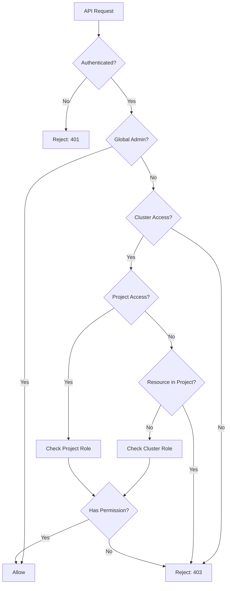

## Security Overview

Rancher implements comprehensive security controls including authentication, authorization, TLS encryption, audit logging, and security hardening features.

<Warning>
Security is a shared responsibility. While Rancher provides security features, proper configuration and maintenance are essential.
</Warning>

## Authentication Mechanisms

Rancher's authentication system is pluggable and supports multiple identity providers simultaneously.

### Authentication Architecture

```go Auth Server
// From pkg/auth/server.go:55
func NewServer(ctx context.Context, wContext *wrangler.Context, 
    scaledContext *config.ScaledContext, 
    authenticator requests.Authenticator) (*Server, error) {
    // Creates authentication middleware
    // Configures auth provider handlers
    // Sets up token management
}
```

### Supported Authentication Providers

<Tabs>
  <Tab title="Local">
    **Local Authentication**
    
    Built-in username/password authentication with:
    
    - **PBKDF2 Password Hashing**: Industry-standard key derivation
    - **Secure Storage**: Passwords stored in Kubernetes secrets
    - **Bootstrap Admin**: First-time admin user creation
    - **Password Policies**: Configurable complexity requirements
    
    ```yaml Local User Storage
    # Namespace: cattle-local-user-passwords  
    # Secrets contain hashed passwords using PBKDF2
    apiVersion: v1
    kind: Secret
    metadata:
      name: user-<username>
      namespace: cattle-local-user-passwords
    data:
      password: <pbkdf2-hash>
    ```
    
    <Info>
    Bootstrap password can be set via Helm: `--set bootstrapPassword=<password>`
    </Info>
  </Tab>
  
  <Tab title="SAML">
    **SAML 2.0 Authentication**
    
    **Location**: `pkg/auth/providers/saml`
    
    Features:
    - Multiple SAML IdP support
    - Metadata import/export
    - Group membership synchronization
    - Attribute mapping
    - Sign-on URL customization
    
    **Endpoints**:
    ```yaml
    /v1-saml/login         # Initiate login
    /v1-saml/acs           # Assertion Consumer Service
    /v1-saml/metadata      # Service Provider metadata
    /v1-saml/idp-metadata  # IdP metadata
    ```
    
    **Supported IdPs**:
    - Active Directory Federation Services (ADFS)
    - Okta
    - Ping Identity
    - Shibboleth
    - KeyCloak
  </Tab>
  
  <Tab title="OIDC">
    **OpenID Connect (OIDC)**
    
    **Location**: `pkg/oidc/` and `pkg/auth/providers/`
    
    Features:
    - Authorization Code flow
    - PKCE support
    - Token refresh
    - UserInfo endpoint
    - Multiple OIDC providers
    
    ```go OIDC Configuration
    type OIDCConfig struct {
        ClientID     string
        ClientSecret string  
        IssuerURL    string
        RedirectURL  string
        Scopes       []string
    }
    ```
    
    **Supported Providers**:
    - Keycloak
    - Azure AD
    - Google
    - Okta
    - Generic OIDC
  </Tab>
  
  <Tab title="LDAP/AD">
    **LDAP and Active Directory**
    
    **Location**: `pkg/auth/providers/`
    
    Implementations:
    - ActiveDirectory
    - OpenLDAP  
    - FreeIPA
    
    Features:
    - User authentication
    - Group membership sync
    - Nested groups
    - Connection pooling
    - TLS/StartTLS
    - Search filters
    
    ```yaml AD Configuration
    servers:
      - ldaps://ad.example.com:636
    serviceAccountDN: cn=rancher,ou=service,dc=example,dc=com
    userSearchBase: ou=users,dc=example,dc=com
    groupSearchBase: ou=groups,dc=example,dc=com
    ```
  </Tab>
  
  <Tab title="OAuth2">
    **OAuth2 Providers**
    
    Additional OAuth2-based providers:
    
    - **GitHub**: Organization and team mapping
    - **Google**: G Suite integration
    - **Azure AD**: Enterprise application
    
    Common features:
    - Organization/domain filtering
    - Team/group synchronization
    - Token refresh
    - Scoped access
  </Tab>
</Tabs>

### Authentication Flow

<Steps>
  <Step title="User Login">
    User initiates login via UI or API with credentials
  </Step>
  <Step title="Provider Authentication">
    Rancher redirects to configured authentication provider (SAML/OIDC) or validates credentials (Local/LDAP)
  </Step>
  <Step title="User Creation">
    On first login, Rancher creates a User resource in Kubernetes
  </Step>
  <Step title="Token Generation">
    Rancher generates an API token stored as a Kubernetes secret
  </Step>
  <Step title="Token Return">
    Token is returned to the client for subsequent requests
  </Step>
</Steps>

### Token Management

**Location**: `pkg/auth/tokens/`

```go Token Types
// User API Tokens
- TTL: Configurable (default: no expiration)
- Scope: User identity and permissions
- Storage: Kubernetes Secret in cattle-system

// Kubeconfig Tokens  
- TTL: Short-lived (renewable)
- Scope: kubectl access to specific cluster
- Format: Bearer token

// Cluster Registration Tokens
- TTL: Configurable
- Scope: Agent registration only
- One-time use or reusable
```

**Token Cleanup**:

```go Token Purge Daemon
// From pkg/auth/tokens/
tokens.StartPurgeDaemon(ctx, management)

// Automatically removes:
// - Expired tokens
// - Tokens for deleted users
// - Revoked tokens
```

<Tip>
API tokens can be managed via UI (User → API Keys) or directly via the `/v3/tokens` API.
</Tip>

## RBAC Model

Rancher implements a hierarchical RBAC system with global, cluster, and project scopes.

### RBAC Architecture

**Location**: `pkg/rbac/`

```go RBAC Components
// From pkg/rbac/
- access_control.go      // Permission evaluation
- common.go              // RBAC helpers
- user_based.go          // User-centric checks
- context_access_control.go  // Request context evaluation
```

### Permission Hierarchy

<AccordionGroup>
  <Accordion title="Global Permissions">
    **Scope**: Entire Rancher installation
    
    Built-in roles:
    - **admin**: Full administrative access
    - **restricted-admin**: Admin without user management
    - **user**: Standard user access
    - **user-base**: Basic authenticated user
    
    Capabilities:
    - Manage authentication
    - Create clusters
    - Manage users
    - Configure global settings
    - Manage catalogs
    
    ```yaml Global Role Binding
    apiVersion: management.cattle.io/v3
    kind: GlobalRoleBinding
    metadata:
      name: user-admin
    globalRoleName: admin
    userName: user-abc123
    ```
  </Accordion>
  
  <Accordion title="Cluster Permissions">
    **Scope**: Specific Kubernetes cluster
    
    Built-in roles:
    - **cluster-owner**: Full cluster access
    - **cluster-member**: Read/write access
    - **cluster-viewer**: Read-only access
    
    Capabilities:
    - Manage workloads
    - Configure cluster settings
    - Manage node pools
    - Access kubectl
    - View resources
    
    ```yaml Cluster Role Template Binding
    apiVersion: management.cattle.io/v3
    kind: ClusterRoleTemplateBinding 
    metadata:
      name: user-cluster-owner
      namespace: c-m-abcdefgh
    clusterName: c-m-abcdefgh
    roleTemplateName: cluster-owner
    userName: user-abc123
    ```
  </Accordion>
  
  <Accordion title="Project Permissions">
    **Scope**: Project within a cluster (namespace group)
    
    Built-in roles:
    - **project-owner**: Full project access
    - **project-member**: Create and edit resources
    - **read-only**: View-only access
    
    Capabilities:
    - Deploy applications
    - Manage namespaces in project
    - Configure project resources
    - Set resource quotas
    - Manage certificates and secrets
    
    ```yaml Project Role Template Binding
    apiVersion: management.cattle.io/v3
    kind: ProjectRoleTemplateBinding
    metadata:
      name: user-project-owner
      namespace: p-abcde  
    projectName: c-m-abcdefgh:p-abcde
    roleTemplateName: project-owner
    userName: user-abc123
    ```
  </Accordion>
</AccordionGroup>

### Role Templates

Rancher uses RoleTemplates to define permissions:

```yaml Role Template Structure
apiVersion: management.cattle.io/v3
kind: RoleTemplate
metadata:
  name: custom-role
context: cluster  # or project
rules:
  - apiGroups: [""]
    resources: ["pods"]
    verbs: ["get", "list", "watch"]
  - apiGroups: ["apps"]
    resources: ["deployments"]  
    verbs: ["*"]
inherited: true    # Available to projects
builtin: false     # Custom role
```

<Info>
Role templates can inherit from other role templates and aggregate permissions.
</Info>

### Access Control Evaluation



## TLS and Certificate Management

**Location**: `pkg/tls/`

### TLS Configuration

Rancher supports multiple TLS termination modes:

<Tabs>
  <Tab title="Rancher-Generated">
    **Rancher-Generated Certificates**
    
    ```yaml Helm Configuration
    ingress:
      tls:
        source: rancher
        secretName: tls-rancher-ingress
    ```
    
    - Self-signed CA generated by Rancher
    - Automatic certificate rotation
    - Suitable for development/testing
    - Not trusted by browsers (requires CA import)
  </Tab>
  
  <Tab title="Let's Encrypt">
    **Let's Encrypt (ACME)**
    
    ```yaml Helm Configuration  
    ingress:
      tls:
        source: letsEncrypt
    letsEncrypt:
      email: admin@example.com
      environment: production
      ingress:
        class: nginx
    ```
    
    - Automatic certificate provisioning
    - Auto-renewal
    - Requires public DNS and open port 80
    - Production-ready certificates
  </Tab>
  
  <Tab title="Custom Certificate">
    **Custom/Existing Certificate**
    
    ```yaml Helm Configuration
    ingress:
      tls:
        source: secret
        secretName: my-tls-secret
    ```
    
    Create secret:
    ```bash
    kubectl -n cattle-system create secret tls my-tls-secret \
      --cert=tls.crt \
      --key=tls.key
    ```
    
    - Use existing certificates
    - Manual renewal
    - Full control over certificate properties
  </Tab>
  
  <Tab title="External TLS">
    **External TLS Termination**
    
    ```yaml Helm Configuration
    tls: external
    ```
    
    - TLS terminated at load balancer/proxy
    - Rancher receives plain HTTP
    - Requires X-Forwarded-Proto header
    - Common in enterprise environments
  </Tab>
</Tabs>

### Agent TLS Mode

**Location**: `pkg/settings/`

```yaml TLS Validation Modes
# From chart/values.yaml:54
agentTLSMode: "strict"  # or "system-store"

# strict (default for 2.9+):
# - Validates against provided CA certificate
# - Rejects invalid/self-signed certs
# - Most secure option

# system-store:
# - Uses OS certificate store  
# - More permissive
# - Legacy compatibility
```

<Warning>
Using `system-store` may allow man-in-the-middle attacks. Use `strict` mode in production.
</Warning>

### Private CA Support

```yaml Private CA Configuration
# Helm values
privateCA: true
additionalTrustedCAs: true

# Create CA bundle secret
kubectl -n cattle-system create secret generic tls-ca \
  --from-file=cacerts.pem=./ca-bundle.crt

# Additional CAs (for auth providers, registries)
kubectl -n cattle-system create secret generic tls-ca-additional \
  --from-file=ca-additional.pem=./additional-ca.crt
```

## Audit Logging

**Location**: `pkg/auth/audit/`

Rancher provides comprehensive audit logging for compliance and security monitoring.

### Audit Log Configuration

```yaml Helm Configuration
auditLog:
  enabled: true
  level: 1  # 0-3
  destination: sidecar  # or hostpath
  maxAge: 10      # days
  maxBackup: 10   # files
  maxSize: 100    # MB
```

### Audit Levels

<Steps>
  <Step title="Level 0: Metadata">
    Logs request metadata:
    - User identity
    - Request path and method
    - Timestamp
    - Response code
    - Source IP
  </Step>
  
  <Step title="Level 1: Metadata + Headers">
    Level 0 plus:
    - Request headers
    - Response headers
  </Step>
  
  <Step title="Level 2: + Request Body">
    Level 1 plus:
    - Request body content
    - Useful for create/update operations
  </Step>
  
  <Step title="Level 3: Full Logging">
    Level 2 plus:
    - Response body content
    - Complete request/response capture
    - Highest verbosity
  </Step>
</Steps>

### Audit Log Format

```json Sample Audit Log Entry
{
  "auditID": "req-abc123",
  "requestURI": "/v1/management.cattle.io.clusters/c-m-abc",
  "verb": "update",
  "user": {
    "username": "user-abc123",
    "groups": ["system:authenticated"]
  },
  "sourceIPs": ["192.168.1.100"],
  "userAgent": "kubectl/v1.28.0",
  "objectRef": {
    "resource": "clusters",
    "namespace": "",
    "name": "c-m-abc",
    "apiGroup": "management.cattle.io",
    "apiVersion": "v3"
  },
  "responseStatus": {
    "code": 200
  },
  "requestReceivedTimestamp": "2024-01-15T10:30:00.000Z",
  "stageTimestamp": "2024-01-15T10:30:00.123Z"
}
```

### Audit Policies

**Location**: `pkg/controllers/auditlog/auditpolicy/`

Custom audit policies can be configured:

```yaml Audit Policy CRD
apiVersion: auditlog.cattle.io/v1
kind: AuditPolicy  
metadata:
  name: custom-policy
spec:
  rules:
  - level: RequestResponse
    users: ["admin"]
  - level: Metadata
    resources:
    - group: "management.cattle.io"
      resources: ["clusters"]
  - level: None
    resources:
    - group: ""
      resources: ["configmaps"]
```

## Security Hardening

### Pod Security

Rancher supports Pod Security Standards and Pod Security Policies:

```yaml Pod Security Configuration
# PSS enforcement via namespace labels
apiVersion: v1
kind: Namespace
metadata:
  name: my-namespace
  labels:
    pod-security.kubernetes.io/enforce: restricted
    pod-security.kubernetes.io/audit: restricted
    pod-security.kubernetes.io/warn: restricted
```

### Security Context Constraints (OpenShift)

**Location**: `pkg/scc/`

For OpenShift deployments:

```yaml SCC Support
# Rancher can register custom SCCs
# Managed via RancherSCCRegistrationExtension feature
features:
  RancherSCCRegistrationExtension: true
```

### Network Policies

Rancher can deploy network policies:

```yaml Network Policy Example
apiVersion: networking.k8s.io/v1
kind: NetworkPolicy
metadata:
  name: rancher-ingress
  namespace: cattle-system
spec:
  podSelector:
    matchLabels:
      app: rancher
  policyTypes:
  - Ingress
  ingress:
  - from:
    - namespaceSelector:
        matchLabels:
          name: ingress-nginx
    ports:
    - protocol: TCP
      port: 80
    - protocol: TCP  
      port: 443
```

### Secret Encryption

Kubernetes secrets are encrypted at rest when etcd encryption is enabled:

```yaml Encryption Configuration
# RKE2/K3s clusters support encryption config
# Managed via EncryptionConfiguration
apiVersion: apiserver.config.k8s.io/v1
kind: EncryptionConfiguration
resources:
  - resources:
    - secrets
    providers:
    - aescbc:
        keys:
        - name: key1
          secret: <base64-encoded-secret>
    - identity: {}
```

## User and Token Security

### User Retention

**Location**: `pkg/auth/userretention/`

```go User Cleanup Policies
// Automatic cleanup of:
// - Inactive users
// - Disabled users
// - Expired tokens

// Configurable retention periods
// Preserves audit trail
```

### Session Management

```yaml Session Configuration  
# Session timeout settings
auth-user-session-ttl-minutes: 960  # 16 hours default
auth-user-session-max-ttl-minutes: 960

# Token settings
auth-token-max-ttl-minutes: 0  # No expiration default
```

### Password Policies

For local authentication:

```go Password Requirements
// Minimum length
// Complexity requirements
// Password history
// Lockout policies
// Configured via auth settings
```

## Webhook Authentication

**Location**: `pkg/auth/webhook/`

Kubernetes webhook token authenticator integration:

```yaml Webhook Config
# Rancher can act as auth webhook for downstream clusters
# Validates Rancher tokens
# Provides user impersonation
```

## Security Best Practices

<AccordionGroup>
  <Accordion title="Authentication">
    <Check>Use external authentication providers (SAML/OIDC/LDAP)</Check>
    <Check>Enable MFA at the identity provider</Check>
    <Check>Regularly rotate API tokens</Check>
    <Check>Use short-lived kubeconfig tokens</Check>
    <Check>Disable unused authentication providers</Check>
  </Accordion>
  
  <Accordion title="Authorization">
    <Check>Follow principle of least privilege</Check>
    <Check>Use projects to isolate teams</Check>
    <Check>Create custom roles for specific needs</Check>
    <Check>Regular RBAC audits</Check>
    <Check>Avoid cluster-admin except when necessary</Check>
  </Accordion>
  
  <Accordion title="Network Security">
    <Check>Enable TLS for all communications</Check>
    <Check>Use strict agent TLS mode</Check>
    <Check>Implement network policies</Check>
    <Check>Restrict ingress access</Check>
    <Check>Use private networks where possible</Check>
  </Accordion>
  
  <Accordion title="Audit and Monitoring">
    <Check>Enable audit logging</Check>
    <Check>Ship logs to SIEM</Check>
    <Check>Monitor authentication failures</Check>
    <Check>Alert on privilege escalation</Check>
    <Check>Regular security reviews</Check>
  </Accordion>
  
  <Accordion title="Secrets Management">
    <Check>Enable etcd encryption</Check>
    <Check>Use external secret stores (Vault)</Check>
    <Check>Rotate secrets regularly</Check>
    <Check>Limit secret access via RBAC</Check>
    <Check>Never commit secrets to git</Check>
  </Accordion>
</AccordionGroup>

## Security Resources

<CardGroup cols={2}>
  <Card title="CIS Benchmark" icon="file-shield">
    Rancher provides CIS scanning for Kubernetes clusters
  </Card>
  
  <Card title="Security Advisories" icon="triangle-exclamation">
    Check [Rancher Security](https://github.com/rancher/rancher/security) for CVEs
  </Card>
  
  <Card title="Hardening Guide" icon="shield-halved">
    Follow official hardening guides for production
  </Card>
  
  <Card title="Compliance" icon="clipboard-check">
    NIST, PCI-DSS, HIPAA considerations
  </Card>
</CardGroup>

## Related Documentation

<CardGroup cols={3}>
  <Card title="Architecture" icon="sitemap" href="/architecture/overview">
    Overall architecture
  </Card>
  <Card title="Components" icon="cube" href="/architecture/components">
    Server components
  </Card>
  <Card title="API Security" icon="key" href="/api-reference">
    API authentication
  </Card>
</CardGroup>
