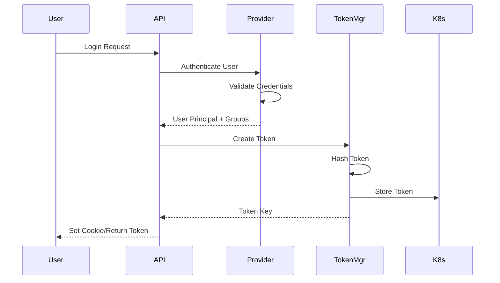

## Authentication Architecture

Rancher provides a flexible, pluggable authentication system that supports multiple authentication providers. The authentication system is built around a token-based architecture that integrates with Kubernetes RBAC for authorization.

### Core Components

The authentication system consists of several key components:

**Authentication Server** (`pkg/auth/server.go`)
- Central authentication server that coordinates all auth operations
- Manages public and private API endpoints
- Routes authentication requests to appropriate providers
- Handles SAML, OIDC, and other provider-specific flows

**Token Manager** (`pkg/auth/tokens/`)
- Creates and manages authentication tokens
- Implements token hashing for enhanced security
- Handles token expiration and lifecycle management
- Supports both login tokens and derived tokens

**Request Authenticator** (`pkg/auth/requests/`)
- Validates incoming authentication requests
- Verifies tokens from headers or cookies
- Integrates with Kubernetes authentication mechanisms
- Supports JWT-based authorization tokens

**Provider Framework** (`pkg/auth/providers/`)
- Pluggable architecture for authentication providers
- Standardized interface for all authentication methods
- Handles user and group principal management
- Supports provider-specific refresh mechanisms

### Authentication Flow

The typical authentication flow in Rancher follows these steps:

#### 1. Initial Authentication

#### 2. Authenticated Request

- User includes token in request (cookie or Authorization header)
- Authenticator extracts and validates token
- Token is verified against stored hash
- User information and groups are retrieved
- Request proceeds with authenticated context

#### 3. Token Refresh

- Providers can implement refresh mechanisms for external tokens
- OAuth providers refresh access tokens automatically
- Token expiration is checked on each request
- Idle timeout is enforced for session tokens

### Authentication Modes

Rancher supports several authentication modes:

**Production Mode**
- Full authentication with configured providers
- Token-based session management
- RBAC integration
- Audit logging

**Always Admin Mode**
- All requests authenticated as admin
- Used for development/testing
- Bypasses all authorization checks

**Header Auth Mode**
- Uses impersonation headers
- Delegates authentication to proxy/ingress
- Supports `Impersonate-User` and `Impersonate-Group` headers

## User Management

### User Types

Rancher distinguishes between several user types:

**Local Users**
- Created directly in Rancher
- Password stored as bcrypt or PBKDF2 hash
- Managed through the local provider
- Full CRUD operations available

**External Users**
- Authenticated through external providers
- User record created on first login
- Linked to external principal ID
- Cannot change password in Rancher

**Service Accounts**
- Kubernetes service account integration
- Used for machine-to-machine authentication
- Token-based authentication only

### Principal System

Principals represent identities in Rancher:

**User Principals**
- Unique identifier for a user in a provider
- Format: `{provider}://{external_id}`
- Examples: `github://12345`, `local://admin`

**Group Principals**
- Represent groups from external systems
- Used for RBAC group bindings
- Automatically synchronized from providers

### User Attributes

Users have several key attributes managed by the system:

- **Principal IDs**: List of all principals associated with user
- **Username**: Display name for the user
- **Enabled**: Whether user can authenticate
- **MustChangePassword**: Force password change on next login (local users)
- **GroupPrincipals**: Cached group memberships
- **Extra Attributes**: Provider-specific metadata

### User Lifecycle

**User Creation**
1. User authenticates with provider
2. Provider returns user principal and groups
3. User record created if not exists
4. Principal IDs linked to user
5. Initial RBAC bindings established

**User Update**
- Group memberships refreshed periodically
- Provider attributes synchronized
- RBAC bindings updated automatically

**User Retention**
- Configurable user retention policies
- Inactive users can be automatically disabled
- User data preserved for audit trail

## Security Features

### Token Hashing

Rancher implements secure token hashing to protect authentication tokens:

- **SHA3-512**: Current default hasher for new tokens
- **SHA-256**: Legacy hasher, still supported
- **Scrypt**: Legacy hasher, still supported
- Tokens stored as hashes in Kubernetes secrets
- Original token never stored in database
- Automatic hash verification on authentication

### Session Security

**Session Tokens**
- HTTP-only cookies for web sessions
- Secure flag enabled for HTTPS
- CSRF protection via separate token
- Configurable session timeout

**API Tokens**
- Bearer token authentication for API clients
- Derived tokens for specific purposes
- Scoped to clusters or namespaces
- Can be created with limited TTL

### Authentication Limits

- API body size limits configurable
- Token expiration enforced
- Idle timeout for interactive sessions
- Maximum token TTL configurable

### Audit Logging

Authentication events are comprehensively audited:

- Login attempts (success and failure)
- Token creation and deletion
- Provider configuration changes
- User attribute modifications
- Sensitive data automatically redacted

## API Endpoints

### Public Endpoints

**`/v1-public`**
- Provider login flows
- OIDC discovery and callback
- Public authentication configuration

**`/v1-saml`**
- SAML assertion consumer service
- SAML metadata endpoints
- Provider-specific SAML handlers

### Private Endpoints (Authenticated)

**`/v3/token`**
- List user tokens
- Create derived tokens
- Delete tokens
- Token actions (logout, logoutAll)

**`/v3/user`**
- User management
- User attribute updates
- Password changes

**`/v3/principal`**
- Principal search
- Principal lookup
- Group membership queries

**`/v3/authConfig`**
- Provider configuration (admin only)
- Enable/disable providers
- Test provider connectivity

## Configuration

### Environment Variables

**`CATTLE_AUTH_API_BODY_LIMIT`**
- Limits request body size for auth endpoints
- Default: 1Mi
- Format: Kubernetes quantity (e.g., "2Mi", "500Ki")

**Feature Flags**
- `Auth`: Enable/disable authentication globally
- `TokenHashing`: Enable secure token hashing
- `SCIM`: Enable SCIM 2.0 support
- `V3Public`: Enable legacy v3-public endpoints

### Settings

**Token Settings**
- `auth-token-max-ttl-minutes`: Maximum token lifetime
- `kubeconfig-default-token-ttl-minutes`: Default TTL for kubeconfig tokens
- `auth-user-session-idle-ttl-minutes`: Idle timeout for sessions

**User Settings**
- User retention policies
- Password complexity requirements (local provider)
- Default user permissions

## Best Practices

1. **Use External Providers**: Leverage existing identity systems (Active Directory, LDAP, SAML, OIDC)
2. **Enable Token Hashing**: Ensure `TokenHashing` feature flag is enabled
3. **Set Token Limits**: Configure appropriate TTLs for tokens
4. **Regular Audits**: Review authentication logs regularly
5. **Least Privilege**: Grant minimal permissions to users and tokens
6. **Secure Cookies**: Always use HTTPS in production
7. **Provider Rotation**: Support multiple providers for gradual migration
8. **Session Timeouts**: Configure idle timeout for interactive sessions

## Troubleshooting

### Common Issues

**Authentication Failures**
- Check provider configuration in AuthConfig
- Verify network connectivity to external providers
- Review audit logs for detailed error messages
- Check token expiration and TTL settings

**Token Issues**
- Verify token format (name:key)
- Check token hasn't expired
- Ensure token hashing is enabled consistently
- Verify token exists in Kubernetes

**Provider Issues**
- Test provider connectivity via API
- Verify certificates for HTTPS endpoints
- Check provider-specific logs
- Ensure callback URLs are correct

## See Also

- [Authentication Providers](/auth/providers) - Detailed provider configuration
- [Token Management](/auth/tokens) - Token types and lifecycle
- [RBAC](/auth/rbac) - Authorization and permissions
- [Audit Logging](/configuration/audit-logging) - Authentication audit trails