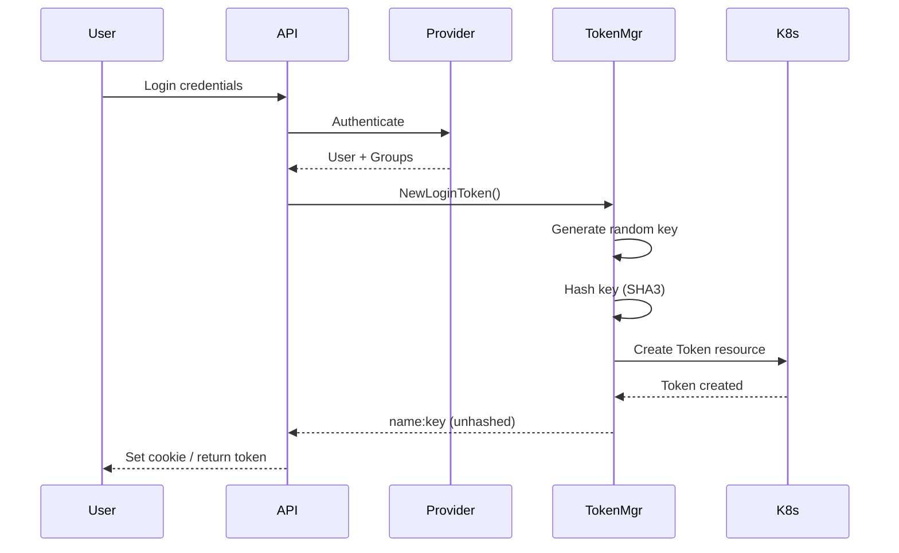
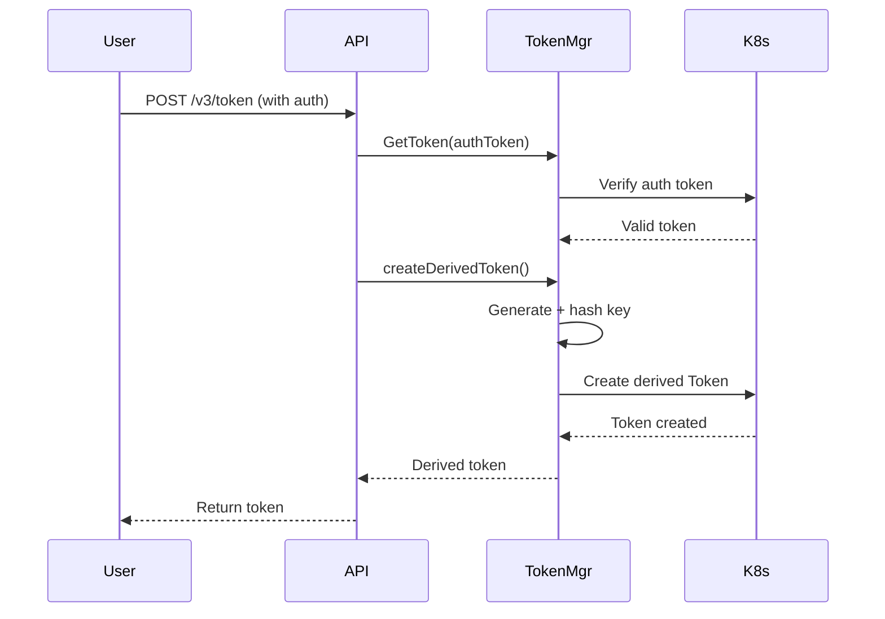

## Overview

Rancher uses token-based authentication for all API requests. Tokens are stored as Kubernetes custom resources (`Token` CRD) and provide flexible authentication for both interactive users and API clients.

All token management is handled by the Token Manager in `pkg/auth/tokens/`.

## Token Architecture

### Token Structure

Rancher tokens consist of two parts:
```
{token-name}:{token-key}
```

- **Token Name**: Kubernetes resource name (stored in etcd)
- **Token Key**: Secret authentication value (hashed when stored)

Example: `token-abcd1:z9x8y7w6v5u4t3s2r1q0`

### Token Resource

Tokens are stored as `Token` custom resources:

```yaml
apiVersion: management.cattle.io/v3
kind: Token
metadata:
  name: token-abcd1
  labels:
    authn.management.cattle.io/token-userId: u-12345
    authn.management.cattle.io/kind: session
  annotations:
    authn.management.cattle.io/token-hashed: "true"
spec:
  token: "$3:hash:hashed-token-value..."  # Hashed token key
  ttlMillis: 57600000  # 16 hours
  description: "Login session"
  userId: u-12345
  authProvider: github
  userPrincipal:
    name: github://12345
    displayName: John Doe
  isDerived: false
  clusterName: ""
status:
  expiresAt: "2026-03-07T12:00:00Z"
  expired: false
```

## Token Types

### Session Tokens (Login Tokens)

**Purpose**: Interactive user sessions (web UI)

**Characteristics**:
- Created during login flow
- Stored in HTTP-only cookie (`R_SESS`)
- Associated with authentication provider
- Contains user principal and groups
- Default TTL: 16 hours (configurable)
- Not marked as derived
- Labeled with `kind: session`

**Lifecycle**:
1. User authenticates with provider
2. Token Manager creates session token
3. Token key hashed using SHA3-512
4. Token stored in Kubernetes
5. Cookie set with token value
6. Token validated on each request
7. Deleted on logout or expiration

### Derived Tokens (API Tokens)

**Purpose**: Programmatic API access

**Characteristics**:
- Created from existing session token
- Not tied to cookie
- User explicitly creates via API
- Optional custom description
- Optional custom TTL (up to max)
- Marked as `isDerived: true`
- Inherits user context from parent

**Creation**:
```bash
curl -X POST 'https://rancher.example.com/v3/token' \
  -H 'Authorization: Bearer token-abcd1:z9x8y7w6...' \
  -H 'Content-Type: application/json' \
  -d '{
    "description": "CI/CD token",
    "ttlMillis": 86400000,
    "clusterId": "c-m-abcd1234"
  }'
```

**Use Cases**:
- CI/CD pipelines
- Automation scripts
- Third-party integrations
- Service accounts
- Mobile applications

### Kubeconfig Tokens

**Purpose**: kubectl access to downstream clusters

**Characteristics**:
- Created for generated kubeconfig files
- Cluster-scoped (specific to one cluster)
- Auto-generated name: `kubeconfig-{username}.{clusterid}`
- Default TTL from setting: `kubeconfig-default-token-ttl-minutes`
- Labeled with `kind: kubeconfig`
- Marked as derived
- Expiration set on creation

**Generation**:
```bash
# CLI generates kubeconfig with embedded token
rancher clusters kubeconfig c-m-abcd1234 --token
```

**Token embedded in kubeconfig**:
```yaml
users:
- name: rancher-user
  user:
    token: token-kubeconfig-alice-c-m-abcd1234-xyz:secretkey...
```

### System Tokens

**Purpose**: Internal Rancher services

**Characteristics**:
- Pre-defined token names (no random generation)
- No TTL (never expire)
- Specific user context
- Cannot be deleted via API
- Used by Rancher agents and controllers

## Token Hashing

### Overview

Token hashing protects authentication tokens by storing only cryptographic hashes, not the original token values. This feature is controlled by the `TokenHashing` feature flag.

**Location**: `pkg/auth/tokens/hashers/`

### Supported Hash Algorithms

Rancher supports multiple hash algorithms for backwards compatibility:

#### SHA3-512 (Current Default)

**File**: `pkg/auth/tokens/hashers/sha3.go`

**Algorithm**: SHA3-512 with random salt

**Format**: `$3:salt:hash`

**Characteristics**:
- Modern cryptographic standard
- 512-bit hash output
- Random 32-byte salt
- Fast verification
- Resistant to length extension attacks

**Example**:
```
$3:a1b2c3d4e5f6...:9f8e7d6c5b4a...
```

#### SHA-256 (Legacy)

**File**: `pkg/auth/tokens/hashers/sha256.go`

**Algorithm**: SHA-256 with random salt

**Format**: `$2:salt:hash`

**Characteristics**:
- Legacy algorithm
- 256-bit hash output
- Still supported for existing tokens
- New tokens use SHA3

#### Scrypt (Legacy)

**File**: `pkg/auth/tokens/hashers/scrypt.go`

**Algorithm**: Scrypt key derivation

**Format**: `$1:salt:hash`

**Characteristics**:
- Original hashing algorithm
- Memory-hard function
- Slower verification (by design)
- Still supported for existing tokens

### Hash Workflow

**Token Creation**:
1. Random token key generated (32 bytes)
2. Token hashed using SHA3-512 with random salt
3. Hash stored in `token` field: `$3:salt:hash`
4. Original token key returned to user once
5. Annotation `authn.management.cattle.io/token-hashed: "true"` added

**Token Verification**:
1. User presents token: `token-name:token-key`
2. Token resource fetched by name
3. Hash version extracted from stored hash
4. Appropriate hasher selected
5. Provided key hashed with same salt
6. Hashes compared for equality
7. Access granted on match

**Implementation**:

```go
// pkg/auth/tokens/token_util.go
func ConvertTokenKeyToHash(token *apiv3.Token) error {
    if !features.TokenHashing.Enabled() {
        return nil
    }
    if token != nil && len(token.Token) > 0 {
        hasher := hashers.GetHasher()  // Returns SHA3
        hashedToken, err := hasher.CreateHash(token.Token)
        if err != nil {
            return errors.New("failed to generate hash from token")
        }
        token.Token = hashedToken
        if token.Annotations == nil {
            token.Annotations = map[string]string{}
        }
        token.Annotations[TokenHashed] = "true"
    }
    return nil
}
```

### Migration

Existing unhashed tokens continue to work:
- Old tokens stored as plaintext
- No automatic migration
- Hashing applied to new tokens only
- Verification detects hashed vs unhashed

### Security Benefits

1. **Database Compromise**: Attackers cannot use stolen hashes
2. **Backup Security**: Backups don't contain usable tokens
3. **Log Safety**: Hashes safe to log
4. **Audit Trail**: Original tokens never persisted

## Token Lifecycle

### Creation

**Login Flow**:


**API Token Creation**:


### Validation

**Per-Request Authentication**:
1. Extract token from `Authorization` header or `R_SESS` cookie
2. Split into name and key components
3. Look up token resource by name (with indexer for performance)
4. Verify key matches stored hash
5. Check token not expired (TTL)
6. Check session not idle (last activity)
7. Return user info and groups

**Indexing**:

Tokens indexed by hashed key for fast lookup:
- Index: `authn.management.cattle.io/token-key-index`
- Indexed value: hashed token key
- Allows cache lookup before client call

### Expiration

**Time-Based Expiration**:

Tokens expire based on TTL:
```go
expiresAt = creationTime + ttlMillis
```

- `ttlMillis: 0` = No expiration (permanent)
- `expiresAt` field set on creation
- Checked on every authentication
- HTTP 410 Gone returned if expired

**Idle Timeout**:

Session tokens support idle timeout:
- Setting: `auth-user-session-idle-ttl-minutes`
- Last activity tracked in token
- Updated on authenticated requests
- Session expires if idle too long
- Only applies to session tokens, not derived tokens

**Maximum TTL**:

Admins can set maximum token lifetime:
- Setting: `auth-token-max-ttl-minutes`
- Applied when creating tokens
- User-requested TTL clamped to max
- `0` = no limit

```go
// pkg/auth/tokens/manager.go
func ClampToMaxTTL(ttl time.Duration) (time.Duration, error) {
    maxTTL := settings.AuthTokenMaxTTLMinutes.Get()
    if maxTTL == 0 {
        return ttl  // No limit
    }
    if ttl == 0 {
        return maxTTL  // Use max
    }
    return min(ttl, maxTTL)  // Clamp
}
```

### Deletion

**Manual Deletion**:
```bash
# Delete specific token
curl -X DELETE 'https://rancher.example.com/v3/token/token-abcd1' \
  -H 'Authorization: Bearer token-xyz:...'
```

**Cannot delete**:
- Current session token (use logout instead)
- Tokens belonging to other users
- System tokens

**Logout**:
```bash
# Logout (delete current session token)
curl -X POST 'https://rancher.example.com/v3/tokens?action=logout' \
  -H 'Authorization: Bearer token-abcd1:...'
```

**Logout All**:
```bash
# Delete all tokens for current user
curl -X POST 'https://rancher.example.com/v3/tokens?action=logoutAll' \
  -H 'Authorization: Bearer token-abcd1:...'
```

**Automatic Cleanup**:

Purge daemon removes expired tokens:
- Runs periodically in leader-elected instance
- Location: `pkg/auth/tokens/purge_daemon.go`
- Deletes tokens where `expiresAt < now`
- Cleans up orphaned token secrets

## Token Management API

**Location**: `pkg/auth/tokens/api.go`

### List User Tokens

```bash
GET /v3/token
Authorization: Bearer {token}
```

**Response**:
```json
{
  "type": "collection",
  "data": [
    {
      "id": "token-abcd1",
      "type": "token",
      "name": "token-abcd1",
      "description": "Login session",
      "userId": "u-12345",
      "authProvider": "github",
      "isDerived": false,
      "current": true,
      "enabled": true,
      "expired": false,
      "expiresAt": "2026-03-07T12:00:00Z",
      "ttl": 57600000
    },
    {
      "id": "token-xyz99",
      "description": "CI/CD token",
      "isDerived": true,
      "current": false,
      "clusterName": "c-m-abcd1234"
    }
  ]
}
```

### Create Derived Token

```bash
POST /v3/token
Authorization: Bearer {token}
Content-Type: application/json

{
  "description": "My API token",
  "ttlMillis": 86400000,
  "clusterId": "c-m-abcd1234"
}
```

**Response**:
```json
{
  "type": "token",
  "id": "token-new99",
  "token": "token-new99:z9x8y7w6v5u4t3s2r1q0",
  "description": "My API token",
  "isDerived": true,
  "ttl": 86400000,
  "expiresAt": "2026-03-07T19:17:00Z"
}
```

**Note**: Token value only returned once during creation.

### Get Specific Token

```bash
GET /v3/token/{token-id}
Authorization: Bearer {token}
```

### Delete Token

```bash
DELETE /v3/token/{token-id}
Authorization: Bearer {token}
```

### Logout

```bash
POST /v3/tokens?action=logout
Authorization: Bearer {token}
```

Deletes current session token and clears cookie.

### Logout All

```bash
POST /v3/tokens?action=logoutAll
Authorization: Bearer {token}
```

Deletes all tokens for the authenticated user.

## Token Authentication Methods

### Bearer Token (Recommended)

```bash
curl -H 'Authorization: Bearer token-abcd1:z9x8y7...' \
  https://rancher.example.com/v3/clusters
```

### Basic Authentication

```bash
curl -u 'token-abcd1:z9x8y7...' \
  https://rancher.example.com/v3/clusters
```

Basic auth automatically converted to bearer token internally.

### Cookie Authentication

Used by web UI:
```
Cookie: R_SESS=token-abcd1:z9x8y7...
```

Set automatically on login.

## Provider Secrets

Some authentication providers require per-user secrets for token refresh and group synchronization.

**Location**: `pkg/auth/tokens/manager.go`

### Providers with Secrets

These providers store per-user secrets:
- `github` - OAuth access token
- `azuread` - OAuth access token
- `googleoauth` - OAuth access token
- `oidc` - Refresh token
- `keycloakoidc` - Refresh token

### Secret Storage

**Namespace**: `cattle-system`

**Name**: `{userId}-secret`

**Structure**:
```yaml
apiVersion: v1
kind: Secret
metadata:
  name: u-12345-secret
  namespace: cattle-system
type: Opaque
data:
  github: base64-encoded-access-token
  azuread: base64-encoded-access-token
```

### Secret Lifecycle

**Creation**:
- Secret created on first login with provider
- Access token from OAuth flow stored
- Used for subsequent group refresh

**Retrieval**:
```go
func (m *Manager) GetSecret(userID, provider string, 
    fallbackTokens []accessor.TokenAccessor) (string, error)
```

Falls back to token `providerInfo` if secret missing.

**Update**:
- Secret updated when token refreshed
- New access token replaces old

**Deletion**:
- Automatic cleanup when user deleted
- No manual deletion API

## Token Security

### Storage Security

1. **Hashed Keys**: Token keys stored as SHA3-512 hashes
2. **Kubernetes Secrets**: Token resources stored in etcd
3. **Encryption at Rest**: Use Kubernetes encryption for etcd
4. **RBAC Protected**: Token resources require authentication to access

### Transmission Security

1. **HTTPS Only**: Always use HTTPS in production
2. **HTTP-Only Cookies**: Cookies not accessible to JavaScript
3. **Secure Cookie Flag**: Cookies only sent over HTTPS
4. **CSRF Protection**: Separate CSRF token for state changes

### Token Scope

1. **User Context**: Tokens tied to specific user
2. **Provider Context**: Tokens linked to auth provider
3. **Cluster Scope**: Optional cluster restriction
4. **Time Limit**: TTL and idle timeout enforced

### Best Practices

1. **Rotate Tokens**: Regularly create new tokens and delete old
2. **Minimum TTL**: Use shortest TTL practical for use case
3. **Separate Tokens**: Different token per application/script
4. **Monitor Usage**: Audit token usage in logs
5. **Delete Unused**: Clean up tokens no longer needed
6. **Secure Storage**: Never commit tokens to source control
7. **Kubeconfig Tokens**: Use short TTL for kubeconfig tokens

## Token Configuration

### Settings

**`auth-token-max-ttl-minutes`**
- Maximum lifetime for any token
- Default: 0 (unlimited)
- Applies to session and derived tokens
- Admin can enforce organizational policy

**`kubeconfig-default-token-ttl-minutes`**
- Default TTL for kubeconfig tokens
- Default: 960 (16 hours)
- Applied when generating kubeconfig
- Can be overridden per request

**`auth-user-session-idle-ttl-minutes`**
- Session idle timeout
- Default: 0 (disabled)
- Only applies to session tokens
- Last activity tracked per request

### Environment Variables

**`CATTLE_AUTH_API_BODY_LIMIT`**
- Limits request size for auth endpoints
- Default: 1Mi
- Protects against large payload attacks

### Feature Flags

**`TokenHashing`**
- Enable/disable token hashing
- Default: Enabled
- Should always be enabled in production
- Only disable for debugging

## Troubleshooting

### Invalid Token

**Error**: HTTP 422 "invalid auth token value"

**Causes**:
- Token format incorrect (missing colon)
- Token key doesn't match hash
- Token name doesn't exist
- Token corrupted or truncated

**Resolution**:
- Check token format: `name:key`
- Verify token not modified
- Create new token if lost

### Expired Token

**Error**: HTTP 410 "must authenticate, expired"

**Causes**:
- TTL exceeded
- Idle timeout exceeded

**Resolution**:
- Login again to get new token
- Increase TTL for API tokens
- Configure idle timeout appropriately

### Token Not Found

**Error**: HTTP 404 "token not found"

**Causes**:
- Token deleted
- Token never created
- User deleted

**Resolution**:
- Create new token
- Verify user still exists
- Check token not auto-purged

### Cannot Delete Token

**Error**: HTTP 400 "Cannot delete token for current session"

**Causes**:
- Attempting to delete active session token

**Resolution**:
- Use `/v3/tokens?action=logout` instead
- Or delete from different session

### Hash Verification Failed

**Error**: Logs show "VerifyHash failed"

**Causes**:
- Token key doesn't match stored hash
- Hash algorithm mismatch
- Token corrupted in database

**Resolution**:
- Create new token
- Check database integrity
- Verify TokenHashing feature flag consistent

## Token Internals

### Indexing

Tokens indexed for performance:

**User ID Index**:
- Label: `authn.management.cattle.io/token-userId`
- Used to: List all tokens for a user
- Query: `labelSelector=authn.management.cattle.io/token-userId={userId}`

**Token Key Index**:
- Name: `authn.management.cattle.io/token-key-index`
- Indexed value: Hashed token key
- Used to: Fast token lookup during authentication
- Avoids client API call when cache hit

### Token Constants

```go
// pkg/auth/tokens/manager.go
const (
    UserIDLabel            = "authn.management.cattle.io/token-userId"
    TokenKindLabel         = "authn.management.cattle.io/kind"
    TokenKubeconfigIDLabel = "authn.management.cattle.io/kubeconfig-id"
    TokenHashed            = "authn.management.cattle.io/token-hashed"
    SecretNamespace        = "cattle-system"
    CookieName             = "R_SESS"
)
```

### Token Accessor Interface

Tokens implement the `accessor.TokenAccessor` interface:
```go
type TokenAccessor interface {
    GetName() string
    GetToken() string
    GetUserID() string
    GetAuthProvider() string
    GetProviderInfo() map[string]string
    GetEnabled() bool
    GetIsExpired() bool
    GetLastActivitySeen() time.Time
}
```

Used throughout codebase for type-safe token handling.

## See Also

- [Authentication Overview](/auth/overview) - Authentication architecture
- [Authentication Providers](/auth/providers) - Provider configuration
- [RBAC](/auth/rbac) - Authorization with tokens
- [API Overview](/api/overview) - Using tokens with API